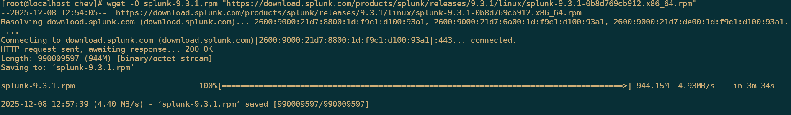

# DHCP (KEA)

02/12/2025

## **Objective**

Set up a **Kea DHCP** server on Rocky Linux, enabling :

- IP address distribution over multiple VLAN subnets,
- centralized configuration,
- stable service,
- the possibility of adding a secondary **failover** server (high availability).

---

# **Introduction**

**Kea** is the modern DHCP server developed by **ISC (Internet Systems Consortium)**.

It replaces **isc-dhcp-server** and offers :

- modular architecture (DHCPv4, DHCPv6, Control Agent, REST API),
- easy-to-read **JSON** configuration,
- native **high availability**,
- support for SQL databases (PostgreSQL / MySQL),
- control via **REST API** (no need to restart the service each time a change is made).

---

# **Hardware used**

## Physical

| Name | Function |
| --- | --- |
| pve1 | DNS1, AD1 |
| pve2 | DNS2, AD2 |

## Virtual

| Name | Status | OS |
| --- | --- | --- |
| DNS1 | Master | Rocky 9 |
| DNS2 | Slave | Rocky 9 |

---

# **Prerequisites**

## Update

```jsx
sudo dnf update -y
```

## NTP configuration

```jsx
sudo dnf install chrony -y
sudo vi /etc/chrony.conf    # Commenter les serveurs existants si besoin
pool 10.20.2.254 iburst

sudo systemctl enable --now chronyd
sudo systemctl status chronyd
```

# **Installation**

## Activate EPEL

```jsx
sudo dnf install -y epel-release
```

### Add official ISC Kea repository

```jsx
curl -1sLf 'https://dl.cloudsmith.io/public/isc/kea-30/setup.rpm.sh' | sudo bash
```

### Install Kea

```jsx
sudo dnf install -y isc-kea
```

# **Configuration**

## Firewall

Kea uses **UDP/67**:

```jsx
sudo firewall-cmd --permanent --add-port=67/udp
sudo firewall-cmd --reload
```

### Save default configuration

```jsx
sudo mkdir /etc/kea/bkp
sudo mv /etc/kea/kea-dhcp4.conf /etc/kea/bkp/kea-dhcp4.conf.bkp
```

### Create a blank configuration

```jsx
sudo vi /etc/kea/kea-dhcp4.conf
```

### Configuration example :

```jsx
{
  "Dhcp4": {
    "authoritative": true,
    "interfaces-config": {
      "interfaces": ["ens18"]
    },
    "valid-lifetime": 28800,
    "renew-timer": 900,
    "rebind-timer": 1800,
    "lease-database": {
      "type": "memfile",
      "persist": true,
      "name": "/var/lib/kea/dhcp4.leases",
      "lfc-interval": 28800
    },
    "options-data": [
      {
        "name": "ntp-servers",
        "data": "10.20.2.254"
      },
      {
        "name": "time-offset",
        "data": "0"
      },
      {
        "name": "domain-name-servers",
        "data": "172.20.21.53, 172.20.23.53"
      }
    ],
    "subnet4": [
      {
        "id": 1,
        "subnet": "172.20.10.0/24",
        "pools": [
          {
            "pool": "172.20.10.130 - 172.20.10.254"
          }
        ],
        "option-data": [
          {
            "name": "routers",
            "data": "172.20.10.254"
          },
          {
            "name": "domain-name",
            "data": "infra.labo"
          },
          {
            "name": "infra.labo",
            "data": "sam.lan"
          }
        ],
        "reservations": [
          {
            "hw-address": "bc:24:11:29:11:09",
            "ip-address": "10.60.1.53",
            "hostname": "dns"
          }
        ]
      }
    ],
    "loggers": [
      {
        "name": "kea-dhcp4",
        "output_options": [
          {
            "output": "/var/log/kea/kea-dhcp4.log"
          }
        ],
        "severity": "INFO"
      }
    ]
  }
}
```

# **Section details**

## interfaces-config

Defines on which interfaces Kea listens for DHCP requests.

```jsx
"interfaces-config": {
  "interfaces": ["ens18"]
}
```

## lease-database

Stores DHCP leases.

```jsx
"lease-database": {
  "type": "memfile",
  "persist": true,
  "name": "/var/lib/kea/dhcp4.leases",
  "lfc-interval": 3600
}
```

## option-data

Global options: DNS, NTP, domain-name...

```jsx
"option-data": [
  { "name": "routers", "data": "10.60.1.254" },
  { "name": "domain-name", "data": "sam.lan" },
  { "name": "domain-search", "data": "sam.lan" }
]
```

## subnet4

Definition of DHCP subnets.

```jsx
"subnet4": [
  {
    "subnet": "172.20.60.0/24",
    "pools": [
      { "pool": "172.20.60.100 172.20.60.199" }
    ],
    "option-data": [
      { ... }
    ]
  }
]
```

Multi-subnet example:

```jsx
"subnet4": [
  { "subnet": "172.20.40.0/24" },
  { "subnet": "172.20.50.0/24" }
]
```

### loggers

```jsx
"loggers": [
  {
    "name": "kea-dhcp4",
    "output_options": [
      { "output": "/var/log/kea-dhcp4.log" }
    ],
    "severity": "INFO"
  }
]
```

## Configuration check

```jsx
sudo kea-dhcp4 -t /etc/kea/kea-dhcp4.conf
```

### Permissions

```jsx
sudo chown root:kea /etc/kea/kea-dhcp4.conf
sudo chmod 640 /etc/kea/kea-dhcp4.conf
```

### Service activation

```jsx
sudo systemctl enable --now kea-dhcp4
sudo systemctl status kea-dhcp4
```

# **DHCP Failover**

## Purpose

**DHCP failover** ensures high availability:

- if the primary server goes down,
- the secondary server automatically takes over.

# **Prerequisites**

## Identical Kea version on both servers

```jsx
kea-dhcp4 -V
```

### Check NTP synchronization

```jsx
chronyc sources
```

# **Firewall**

Kea failover uses **TCP/8000** and **TCP/8005**:

```jsx
sudo firewall-cmd --permanent --add-port=8000/tcp
sudo firewall-cmd --permanent --add-port=8005/tcp
sudo firewall-cmd --reload
```

# **Align configuration**

Copy config file *exactly* 

```jsx
scp /etc/kea/kea-dhcp4.conf root@dhcp2:/etc/kea/
```

## Install Control Agent

```jsx
sudo dnf install -y isc-kea-ctrl-agent
sudo systemctl enable --now kea-ctrl-agent
sudo systemctl status kea-ctrl-agent
```

# **Configure kea-ctrl-agent.conf**

Save :

```jsx
sudo mkdir /etc/kea/bkp
sudo mv /etc/kea/kea-ctrl-agent.conf /etc/kea/bkp/kea-ctrl-agent.conf.bkp
```

Example server #1 :

```jsx
{
  "Control-agent": {
    "http-host": "172.20.23.67",
    "http-port": 8000,
    "control-sockets": {
      "dhcp4": {
        "socket-type": "unix",
        "socket-name": "/var/run/kea/ctrl-socket"
      }
    },
    "authentication": {
      "type": "basic",
      "realm": "kea-control-agent",
      "clients": [
        {
          "user": "admin",
          "password": "formation"
        }
      ]
    }
  }
}
```

### Permissions :

```jsx
$ sudo chown root:kea /etc/kea/kea-ctrl-agent.conf
$ sudo chmod 640 /etc/kea/kea-ctrl-agent.conf
```

### Restart the agent

```jsx
$ sudo systemctl restart kea-ctrl-agent
$ sudo systemctl status kea-ctrl-agent
```

### Configuring the Control Socket

On each server, open /etc/kea/kea-dhcp4.conf and add the following:

```jsx
{
 "Dhcp4": {
 ...
 "control-socket": {
  "socket-type": "unix",
  "socket-name": "/run/kea/ctrl-socket"
  },
 ...
 }
}
```

### Add the High-Availability hook

On server N°1, add the following to /etc/kea/kea-dhcp4.conf

```jsx
{
  "Dhcp4": {    ...
    "hooks-libraries": [
      {
        "library": "/usr/lib64/kea/hooks/libdhcp_lease_cmds.so"
      },
      {
        "library": "/usr/lib64/kea/hooks/libdhcp_ha.so",
        "parameters": {
          "high-availability": [
            {
              "this-server-name": "dhcp1",
              "mode": "hot-standby",
              "heartbeat-delay": 2000,
              "max-response-delay": 10000,
              "max-ack-delay": 2000,
              "max-unacked-clients": 0,
              "peers": [
                {
                  "name": "dhcp1",
                  "url": "http://10.60.1.67:8005/",
                  "role": "primary",
                  "auto-failover": true
                },
                {
                  "name": "dhcp2",
                  "url": "http://10.60.1.68:8005/",
                  "role": "standby",
                  "auto-failover": true
                }
              ]
            }
          ]
        }
      }
    ]    ...
  }
}
```

On server N°2, add the same thing as for N°1 but change this line :

```jsx
"this-server-name": "dhcp2",
```

### Check configuration

On each server, check configuration after editing:

```jsx
$ sudo kea-dhcp4 T /etc/kea/kea-dhcp4.conf
```

## Clean reboot

### First on the standby server (dhcp2) :

```jsx
$ sudo systemctl restart kea-ctrl-agent
$ sudo systemctl restart kea-dhcp4
```

### Then on the primary server (dhcp1):

```jsx
$ sudo systemctl restart kea-ctrl-agent
$ sudo systemctl restart kea-dhcp4
```

## Check

Connect a client workstation to the SA1 switch in the *User* VLAN, then check the correct assignment of network parameters (IP address, default gateway and DNS servers).

