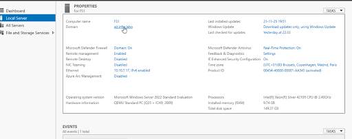
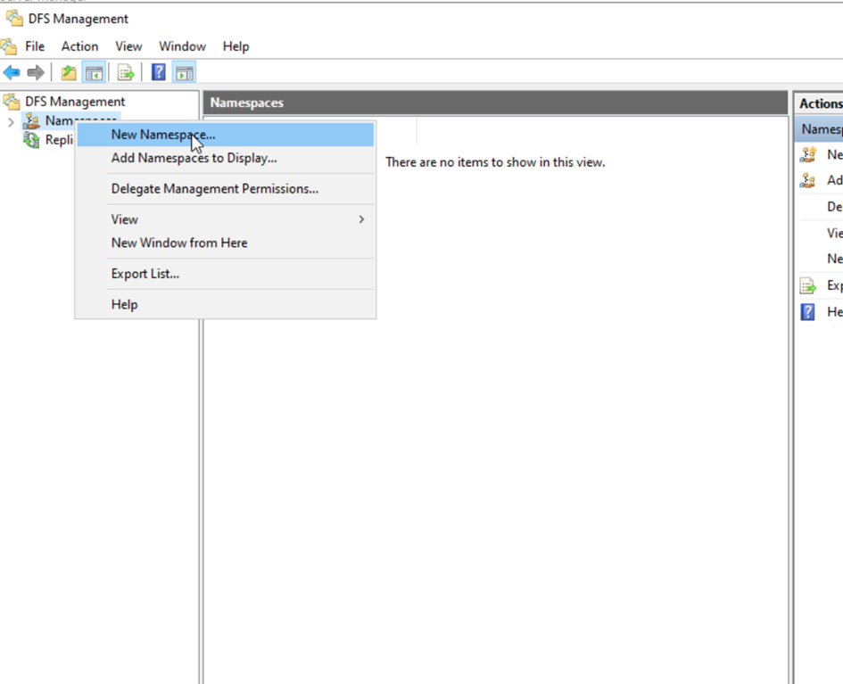
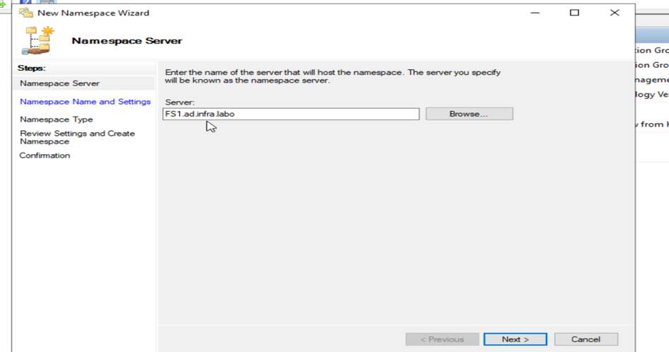

# DFS (EN)

# **DFS: DISTRIBUTED FILE SYSTEM**

### **Objective**

provides a detailed guide to installing the **Distributed File System (DFS)** role on Windows Server 2022. The **DFS (Distributed File System)** role on Windows Server is designed to improve data access and redundancy by dissociating the logical path used by the user from the actual physical location of data on file servers. its strengths:

---

### **Hardware used**

- **A computer running Windows 11** (Pro or Enterprise version is ideal**):** This is your physical machine, the one that will host our virtual server.
- **Windows Server ISO file:** This is the installation program for our future server’s operating system.
- **Virtualization software** (Promox**):** Virtualization allows us to create a “computer within our computer”. So we don’t need a dedicated physical machine for our server.

### **Example environment :**

**◦ Target server**: DC1.ad.infra.local

◦ **Pre-existing roles**: This server is also Active Directory domain controller for the ad.infra.local domain and acts as DNS server.

### **Introduction: What is DFS and why use it?**

The Distributed File System**(DFS)** is a Windows Server role that radically simplifies access to and management of file shares in the enterprise. Think of it as a sophisticated “pointer system” or “logical association”. Instead of users directly accessing a share on a specific server (such as -file-01Documents ), DFS lets you create a unified, virtual access path (for example, -domain-01Documents ).

### **ADVANTAGES OF DFS**

**Simplified maintenance**: in the event of a server failure or migration, the access path remains identical for the user. Only the target behind the DFS folder is modified.

**High availability**: Thanks to the possibility of having several targets for the same DFS folder (requires DFS-R for data replication) and several **namespace** servers **for domains**. “If one is down, it continues to work, since we have this high availability.

**Load balancing**: DFS can distribute the load between different targets if several are configured for the same folder (requires DFS-R).

**Native integration**: Windows-integrated solution, requiring no third-party software.

**Single DNS name**: Simplifies access for users via a logical DNS name.

### **DFS INSTALLATION AND CONFIGURATION**

### **Rename Server**

By default, Windows assigns a random name to the computer. It is recommended to give it a meaningful name before installing important roles.

1. In the **Server Manager** which opens on startup, go to the Local Server section on the left.
2. Click on the name of the current computer (which looks like WIN-XXXXXXX).
3. In the “System Properties” window, click on the Modify button.
4. Enter the new name: FS1.
5. Click on OK and agree to restart the server for the name change to take effect.
6. The FS1 server is added to the Active Directory domain ad-infra.local as a member server, but this is not mandatory.

image.png

**Note:** The server may also remain in Workgroup for the rest of the operation, and this will not prevent it from becoming a DFS server directly.

### **Installing the “DFS Namespaces” role**

We’ll start by installing the necessary role via the Server Manager GUI.

1. Open Server Manager and click on **Add roles and features**.
2. Follow the wizard to the Server Roles step .
3. Expand the File and Storage Services section, then expand the child section of the same name again.
4. Check the DFS namespaces box. A pop-up window will appear to add management tools. Click on Add features.

image.png

1. Make sure the DFS Replication box is checked for this project.
2. Click Next until the end of the wizard, then click Install.

image.png

1. Once installation is complete, click on Close.

The role is now installed. We can now open the dedicated management console to start configuring our first namespace.

### **Creating the namespace**

1. In Server Manager, go to Tools and open the DFS Distributed File System Management console.
2. Right-click on the Namespaces node in the left-hand pane and select New **namespace….**

image.png

1. **Specify server:** Enter the name of your server which will host the namespace (eg:

FS1.ad.infra.local) and click Next.

image.png

1. **Name the namespace:** Give your namespace a name. This name will form part of the UNC path. For this project, use Shares. The final path will be your shared domain . Click on Next.

image.png

By clicking on the Modify button at this stage, you can see the local path where DFS will store your namespace structure (by default, C:). It’s crucial to understand that this folder will not contain any user data. It is only a container for namespace metadata, i.e. the “pointers” and structure of your logical folders.

1. **Choose the type of namespace:** You have two main options. The choice is crucial to the scalability and resilience of your infrastructure.

| Type of namespace | Description |
| --- | --- |
| **Domain namespace** | Based on Active Directory. The access path uses the domain name . Allows multiple namespace servers for high availability. Recommended for enterprise use. |
| **Stand-alone namespace** | Linked to a single server. The access path uses the server name . Does not offer high availability at the level of the namespace itself. |
1. Select Domain namespace, leave “Windows Server 2008” mode enabled (to benefit from features such as access-based enumeration), and click Next.

image.png

1. Check the summary, then click on Create.

image.png

image.png

Our namespace is now created. It functions as an “empty shell” or entry point. The next step is to populate it with folders to make it useful.
