# DFS AND DFSR

## Objective

Configure a replication group between two file servers FS1 and FS2 to ensure high availability of a shared folder.

Set up replication of a named shared folder between two servers to ensure continuity of access in the event of failure of one of them.

| **Elements** | **Description** |
| --- | --- |
| **Target servers** | FS1, FS2 |
| **Namespace server** | FS1 |
| **DFS Namespace** | .infra.labo |
| **Folders to Replicate** | TeamInfra, TeamVi, |

## Introduction

Dependence on single file servers poses a significant risk to business continuity, creating single points of failure that can cripple access to critical data in the event of failure. Distributed File System Replication (DFSR) offers a strategic solution to this challenge. By synchronizing data across multiple servers, DFSR not only guarantees high availability, but also optimizes access performance for users.

- DFSR is the “replication service which is linked to DFS and which will enable us, to replicate data between several file servers.”
- This is a continuation of the presentation of the DFS role (DFS namespaces).

### **Advantages of DFSR (with DFS)**

Implementing DFS replication will enable us to achieve several strategic objectives that will reinforce the robustness and efficiency of our file infrastructure.

- **Ensure high data availability:** By continuously replicating data across multiple servers, we eliminate the single file server as a point of failure. In the event of server unavailability (hardware failure, maintenance), users are seamlessly redirected to another active server, guaranteeing uninterrupted file access and business continuity.
- **Implement Load Balancing:** The solution distributes client connections between different servers hosting the same data. This distribution of requests significantly improves response times and overall performance, particularly in high-demand environments or on remote sites.
- **Centralize data access:** Integrated with existing DFS namespaces, DFSR replication reinforces the principle of a unified access point. Users access a single, stable network path (e.g.: `\\domain\Partages\Folder`), without having to worry about which physical server hosts the data, simplifying navigation and resource management.
- **Multiple targets**: “For a single folder, for a single resource, data can be hosted on several file servers, which will be synchronized thanks to DFSR”.

## Implementation

### Repartition of server roles

A clear distinction of roles is essential to the smooth operation of the DFS solution. Each server in the architecture has a specific function:

- **FS1 (Namespace Server):** This server hosts the **DFS Namespaces** role, as well as the centralized management console. It acts as the single point of entry for users accessing the \ad `.infra.labo\Shares` share, transparently redirecting them to one of the file servers.
- **FS1 and FS2 (File Servers):** These two servers host physical copies of TeamVi folder data. Installing the **DFS Replication (DFSR)** role on each of these servers is a critical technical prerequisite, as it is this service that will ensure the synchronization of files between them.

### **Installing the DFS role and creating a domain name space**

**Installing the “DFS namespaces” role**

We’ll start by installing the necessary role via the Server Manager GUI.

1. Open **Server Manager** and click on **Add roles and features**.
2. Follow the wizard to the **Server Roles** step.
3. Expand the **File and Storage Services** section, then expand the child section of the same name again.
4. Check the **DFS namespaces** box. A pop-up window will appear to add management tools. Click on **Add features**.

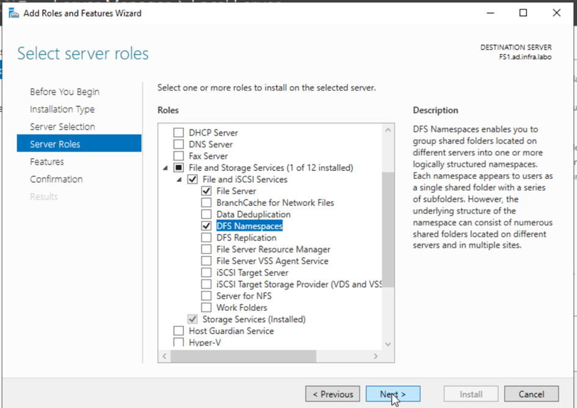

image.png

1. Make sure that **DFS Replication** is not checked for this project.
2. Click **Next** until the end of the wizard, then click **Install**.

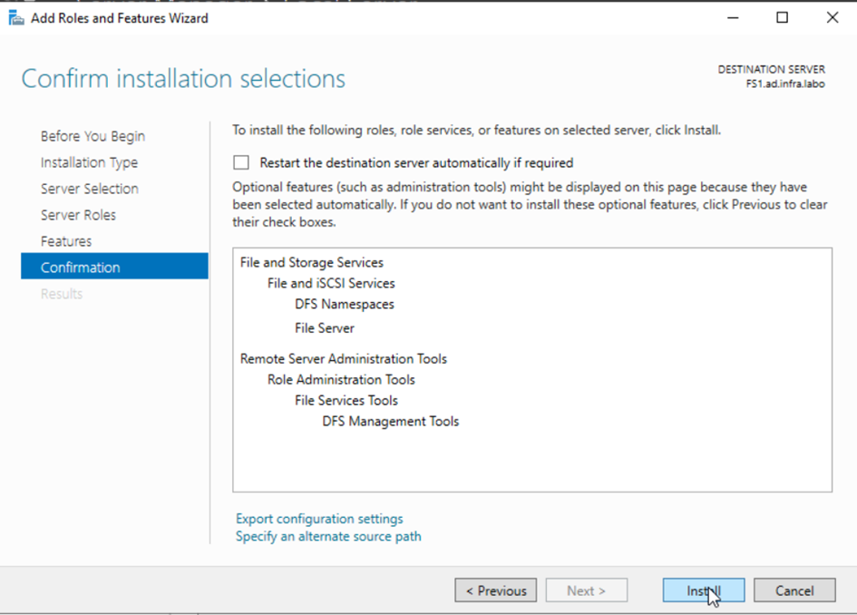

image.png

1. Once installation is complete, click on **Close**.

The role is now installed. We can now open the dedicated management console to start configuring our first namespace.

**Creating the namespace**

1. In **Server Manager**, go to **Tools** and open the**DFS Distributed File** **System Management** console ****.
2. Right-click on the **Namespaces** node in the left-hand pane and select **Newnamespace.**

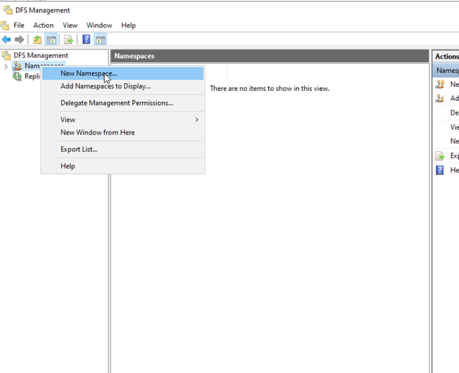

image.png

1. **Specify server:** Enter the name of your server which will host the namespace (e.g. `FS1.ad.infra.labo`) and click **Next**.

image.png

1. **Name the namespace:** Give your namespace a name. This name will form part of the UNC path. For this Project, use Shares. The final path will be \ad `.infra.labo\Shares`. Click on **Next.**

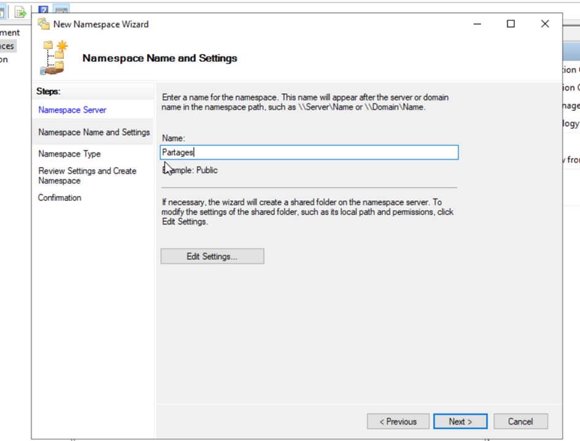

image.png

By clicking on the **Edit** button at this stage, you can see the local path where DFS will store your namespace structure (by default, `C:\DFSRootsShares`). It’s crucial to understand that this folder will not contain **any user data**. It is only a container for namespace metadata, i.e. the “pointers” and structure of your logical folders.

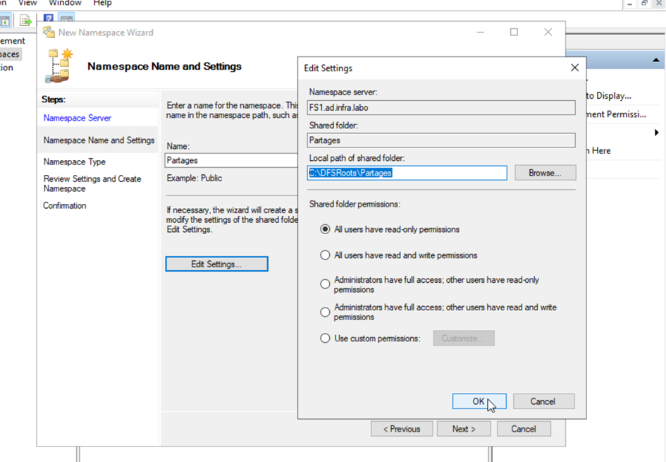

image.png

1. **Choose the type of namespace:** You have two main options. The choice is crucial to the scalability and resilience of your infrastructure.

| Type of namespace | Description |
| --- | --- |
| **Domain namespace** | Based on Active Directory. The access path uses the domain name`.` Allows multiple namespace servers for high availability. Recommended for enterprise use. |
| **Stand-alone namespace** | Linked to a single server. The access path uses the server name`.` Does not offer high availability at the level of the namespace itself. |
1. Select **Domain namespace**, leave “Windows Server 2008” mode enabled (to benefit from features such as access-based enumeration), and click **Next.**

image.png

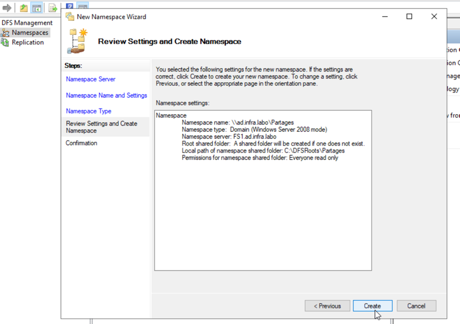

image.png

1. Check the summary, then click on **Create**.

image.png

Your namespace is now created. It functions as an “empty shell” or entry point. The next step is to populate it with folders to make it useful.

### **Installing the prerequisites**

The DFS Replication role must be installed on all servers that will host replicated data.

1. **Open** `Server Manager` on FS1 and `FS2`.
2. **Run** the Add Roles and Features Wizard.
3. **Navigate** to the `Server Roles` section, then expand `File and Storage Services`.
4. **Check** the **DFS Replication** box in the list of role services.

image.png

1. **Confirm** selections and **complete** installation.

image.png

1. **Repeat** this operation on the file server, `FS1`.

image.png

**Creating folders and targets**

In DFS, a folder can be a simple organization container or an active link (a “target”) to an actual network share.

**Creating an organization folder (without a target)**

First, let’s create a folder that will be used solely to structure our tree structure.

1. In the **Gestion DFS** console, expand your new namespace`(\ad.infra.labo\Partages`).
2. Right-click on it and select **New folder**.

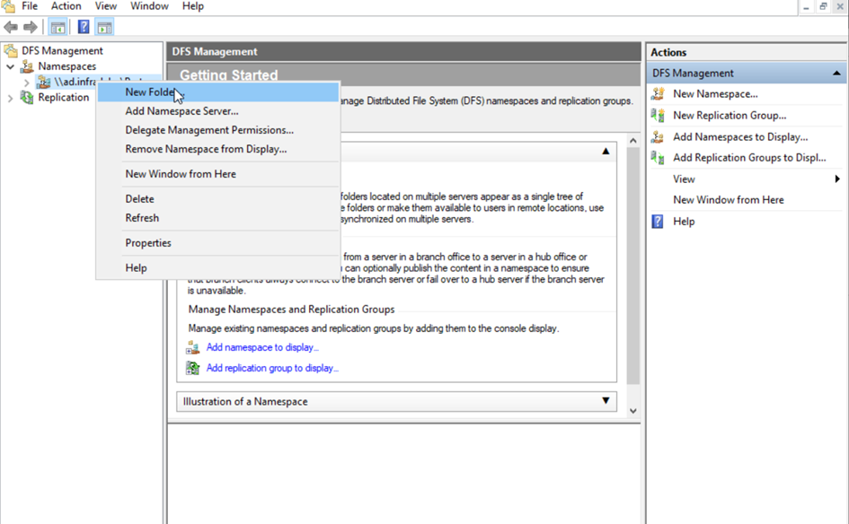

image.png

1. Name the folder `Project`.
2. Do NOT click on **Add…** a folder target. Leave this section blank.
3. Click on **OK**. This folder is now a simple logical container in your namespace.

**Creating a folder with a target (a link to an actual share)**

Now let’s create the folder that will point to our existing file share.

[!IMPORTANT] Before continuing, make sure you’ve created and configured a file share on your file server. For this example, we’re using a share named `TeamInfra, TeamVi`, accessible via the path  `.ad.infra.labo\TeamInfra, \FS1.ad.infra.labo\TeamVi`. Make sure that sharing permissions and NTFS permissions on the TeamInfra, TeamVi folder are correctly configured upstream. Any access errors at target level will be reflected in the DFS path.

1. Right-click on the \ad `.infra.labo\Shares` folder you have just created and select **New folder**.
2. Name this new folder `TeamVi`.

image.png

1. This time, click on the **Add….** button **.**

image.png

1. In the **Path to folder target** field, enter the full UNC path to your existing network share (e.g. \FS1 `.ad.infra.labo\TeamVi`).
2. Click **OK**, then **OK** again. The `TeamVi` folder now appears with a link icon, indicating that it points to a target.

Our structure is in place. Now it’s time to check that everything is working as expected from the user’s point of view.

**Creating the replication group**

We’re now going to configure synchronization from the DFS management console.

**Add the second folder target**

Before replicating, we need to tell DFS that a second copy of our folder exists.

1. **Open the console:** Connect to the server managing your namespace`(FS1.ad.infra.labo` in our case). Open**Server Manager**, go to **Tools**, and select **Distributed File System (DFS) Management**.
2. **Add target:** In the tree on the left, navigate to your folder (in this case, `TeamVi`). Right-click on it and select**Add folder target….**

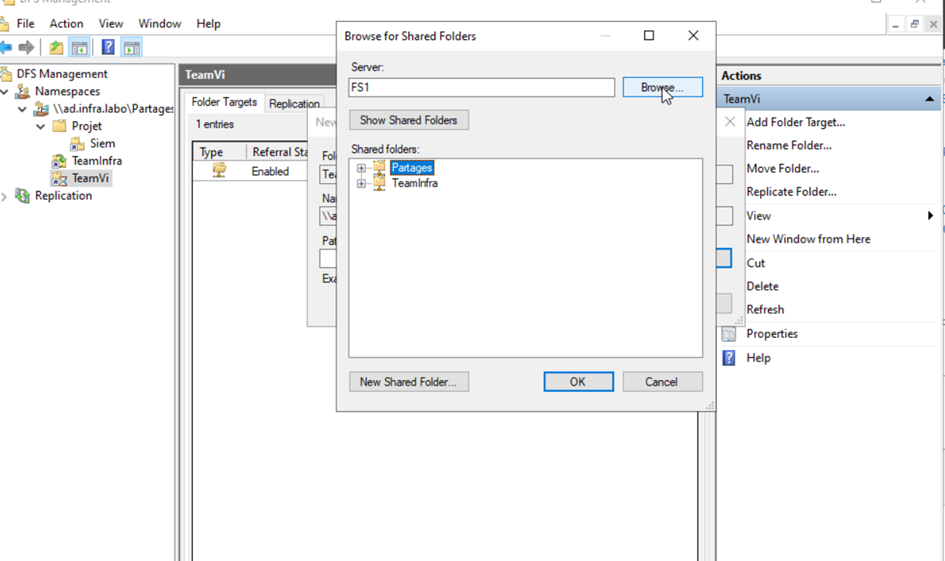

image.png

1. **Specify path:** In the window that opens, enter the UNC path of the share on the second server. In our example, this will be `\\FS2\Partages\TeamVi`. Click on **OK**.

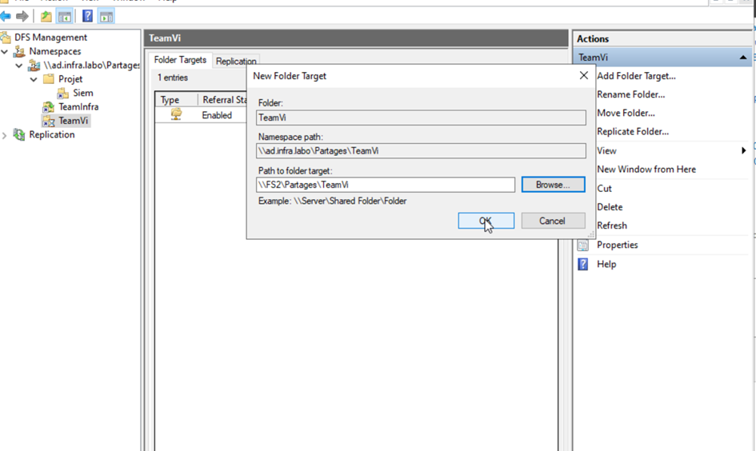

image.png

1. **Start the wizard:** A window then appears, prompting you to create a replication group to synchronize data between the two targets. That’s exactly what we want to do! Click **Yes** to launch the configuration wizard.

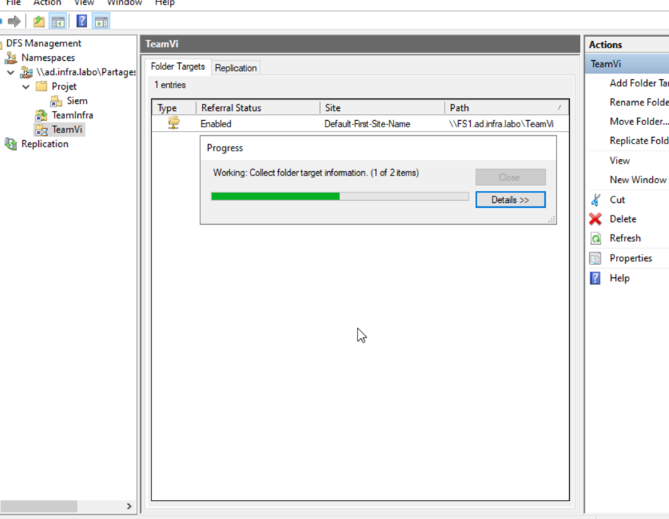

image.png

**Configuring the replication group via the wizard**

The wizard will guide you through the various steps involved in setting up the synchronization.

1. **Verification and group name:** The wizard begins by checking that the DFSR role is installed on `FS1.ad.infra.labo` and `FS2.ad.infra.labo`. The replication group and folder names are generated automatically. You can leave them as default and click **Next**.

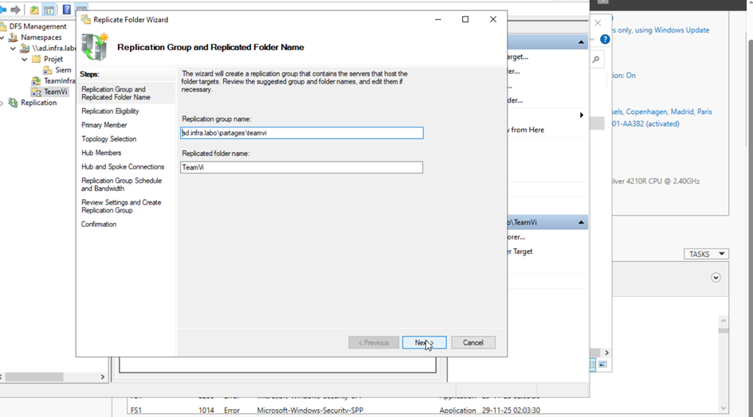

image.png

image.png

1. **Primary member :** This step is crucial for initial synchronization. You need to designate the server that contains the reference data that will be copied to the other server on startup. Select `FS1.ad.infra.labo`. This means that the contents of the `TeamVi` folder on `FS1.ad.infra.labo` will be considered the “source of truth”. Once this step has been completed, replication becomes bidirectional.

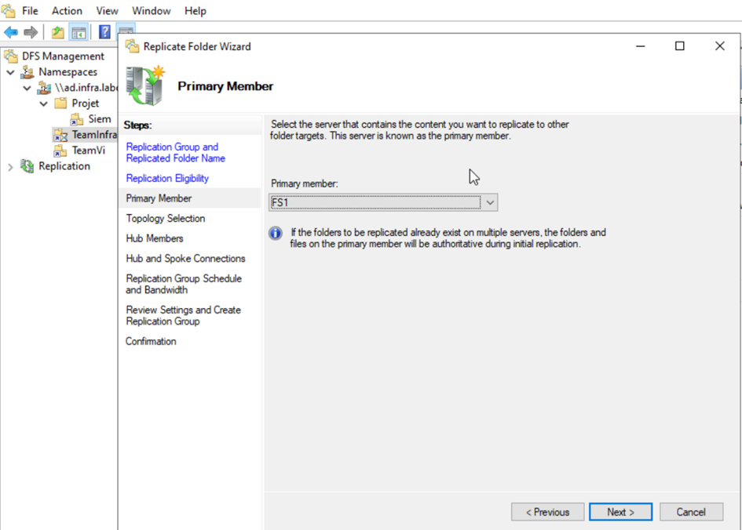

image.png

1. **Topology:** Topology defines how servers communicate with each other. For a two-server configuration, **Full Mesh** is the only logical option and is selected by default. Each server synchronizes directly with the other. Hub-and-Spoke topology is useful for more complex scenarios (3 or more servers).

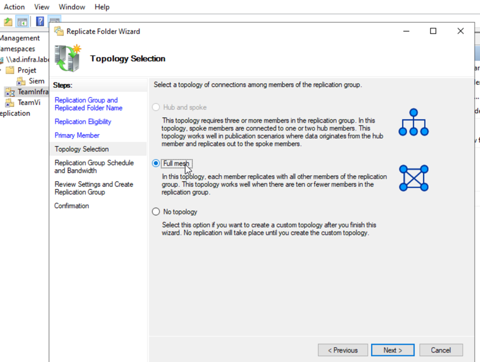

image.png

1. **Scheduling and bandwidth :** Here you can control the impact of replication on your network. For servers located on the same site with a good connection, leave the option **Continuous replication using specified bandwidth** set to “Full”. You may wish to schedule replication or limit bandwidth if the servers are on remote sites.

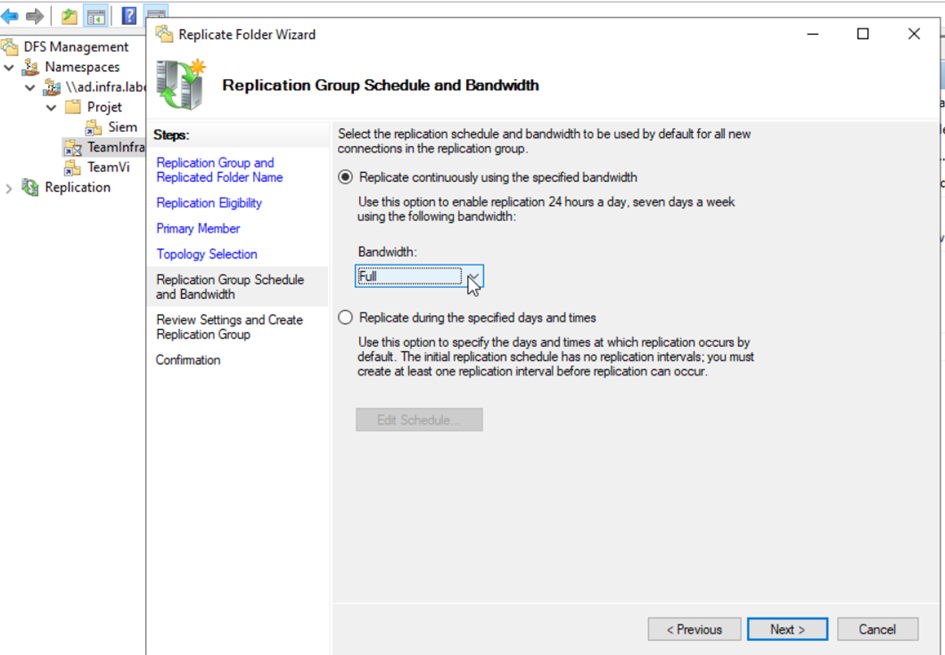

image.png

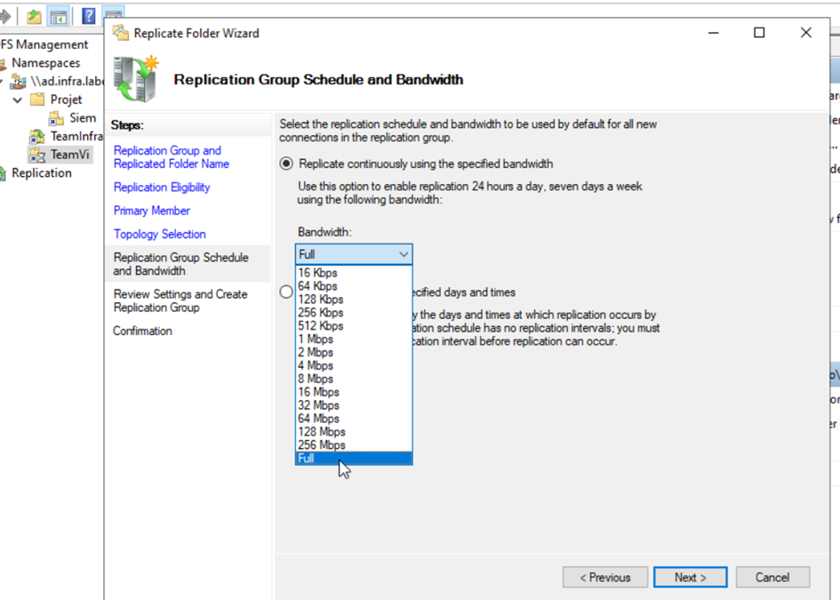

image.png

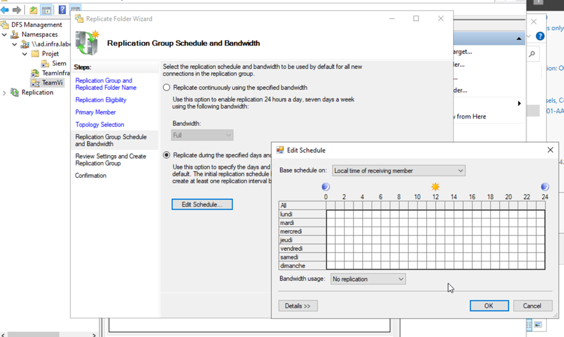

image.png

1. **Verification and creation:** A summary of your configuration is displayed. Check that all the information is correct, then click on **Create**.

image.png

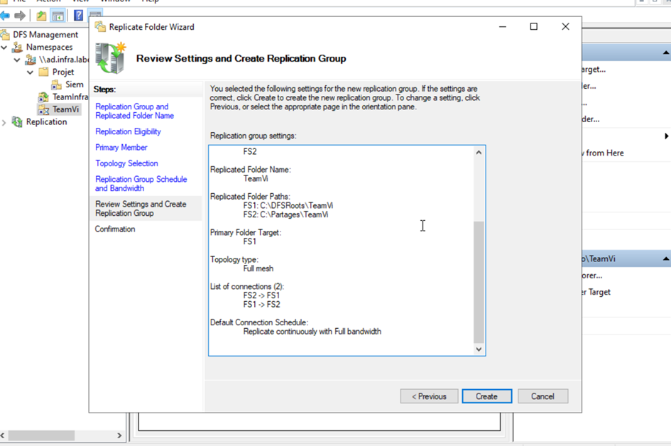

image.png

Your configuration is now complete! Now all we need to do is check that everything is working as planned.

image.png

**Checking and testing replication**

Once the group has been created, it’s essential to ensure that synchronization is active.
