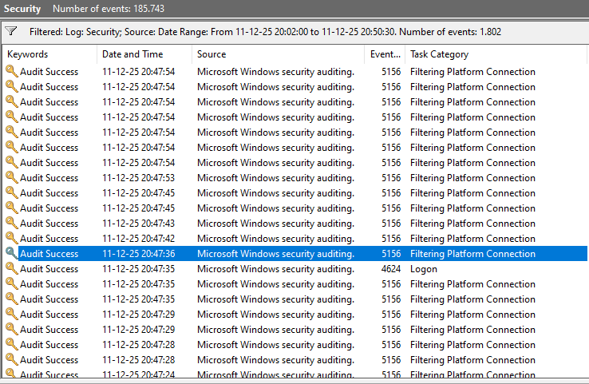
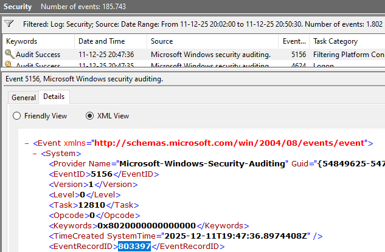
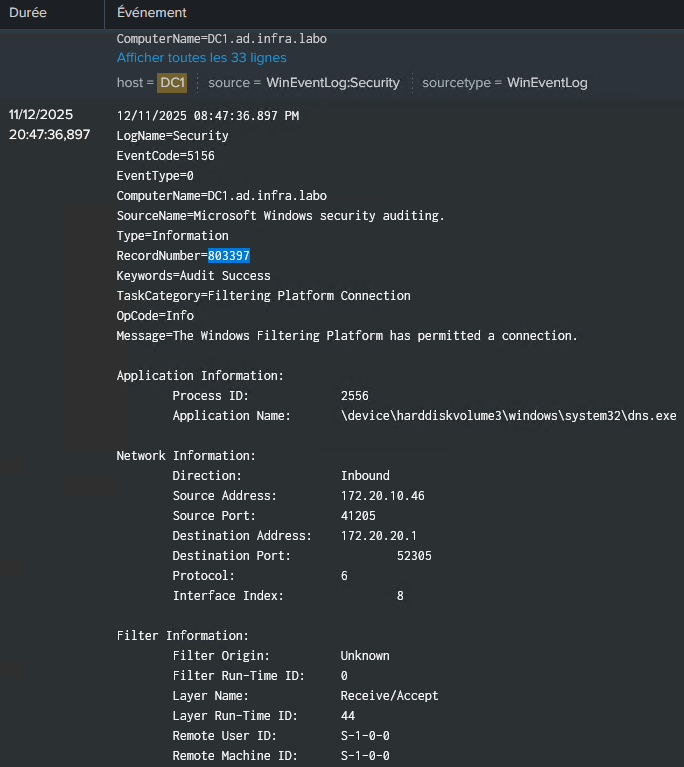
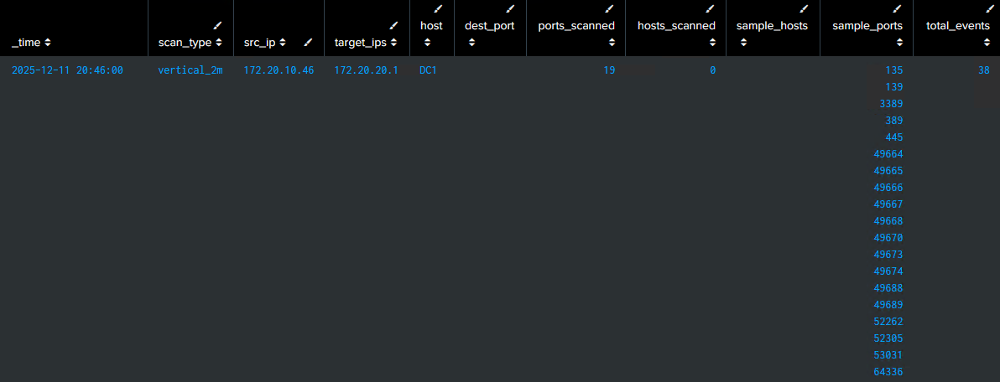
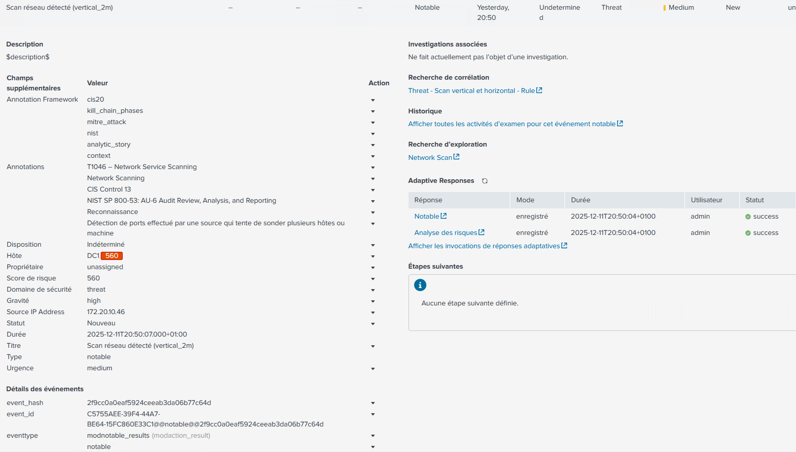

# Scans with Nmap

## **1. Test Objectives**

The objectives of this assessment are:

- To identify the presence of horizontal and vertical network scans.
- To observe the logs generated on an Active Directory during these scans.
- To verify that logs are being sent to Splunk and that corresponding alerts are being generated.

## **2. Scope of the Assessment**

The assessment was conducted on the following LAN network: 172.20.20.0/24

Targets include:

- All hosts on the network for horizontal scanning.
- A specific machine 172.20.20.1 for vertical scanning.

## **3. Context and Environment**

This analysis is part of an internal security testing exercise.

The target environment is an Active Directory network, with logs viewable in Event Viewer.

Splunk is configured to collect and monitor these logs using a Splunk forwarder.

## **4. Tools Used**

**Nmap 7.94SVN**

Commands used:

- Scanning active hosts:

```arduino
sudo nmap -PS445,135 -PA445,135 -sn 172.20.20.0/24
```

- Horizontal scan:

```arduino
sudo nmap -p389,3389 -Pn -n 172.20.20.1 172.20.20.2
```

- Vertical scan:

```arduino
sudo nmap -p- -sS -sV -sC -Pn -n 172.20.20.1
```

## **5. Methodology**

### 5.1 Discovering the Hosts

```arduino
sudo nmap -PS445,135 -PA445,135 -sn 172.20.20.0/24

Starting Nmap 7.94SVN ( https://nmap.org ) at 2025-12-09 15:05 CET
Nmap scan report for 172.20.20.1
Host is up (0.0020s latency).
Nmap scan report for 172.20.20.2
Host is up (0.0016s latency).
Nmap done: 256 IP addresses (2 hosts up) scanned in 4.10 seconds
```

### 5.2 Performing the Horizontal Scan

Scanning specific ports 389 and 3389 on all active hosts on the LAN network to observe system response and log generation.

```arduino
sudo nmap -p389,3389 -Pn -n 172.20.20.1 172.20.20.2

Starting Nmap 7.94SVN ( https://nmap.org ) at 2025-12-09 15:10 CET

Nmap scan report for 172.20.20.1
Host is up (0.0019s latency).

PORT     STATE SERVICE
389/tcp  open  ldap
3389/tcp open  ms-wbt-server

Nmap scan report for 172.20.20.2
Host is up (0.0020s latency).

PORT     STATE    SERVICE
389/tcp  filtered ldap
3389/tcp open     ms-wbt-server

Nmap done: 2 IP addresses (2 hosts up) scanned in 1.32 seconds
```

### 5.3 Performing the vertical scan

Complete analysis of the ports of a specific host to observe the generated logs.

```arduino
sudo nmap -p- -sS -sV -sC -Pn -n 172.20.20.1

Starting Nmap 7.94SVN ( https://nmap.org ) at 2025-12-10 14:14 CET
Nmap scan report for 172.20.20.1
Host is up (0.0021s latency).
Not shown: 49144 filtered tcp ports (no-response), 16370 closed tcp ports (reset)
PORT      STATE SERVICE       VERSION
53/tcp    open  domain        Simple DNS Plus
88/tcp    open  kerberos-sec  Microsoft Windows Kerberos (server time: 2025-12-10 13:15:17Z)
135/tcp   open  msrpc         Microsoft Windows RPC
139/tcp   open  netbios-ssn   Microsoft Windows netbios-ssn
389/tcp   open  ldap          Microsoft Windows Active Directory LDAP (Domain: ad.infra.labo0., Site: Default-First-Site-Name)
445/tcp   open  microsoft-ds?
3389/tcp  open  ms-wbt-server Microsoft Terminal Services
| ssl-cert: Subject: commonName=DC1.ad.infra.labo
| Not valid before: 2025-11-20T14:02:07
|_Not valid after:  2026-05-22T14:02:07
|_ssl-date: 2025-12-10T13:16:29+00:00; -9s from scanner time.
| rdp-ntlm-info:
|   Target_Name: AD
|   NetBIOS_Domain_Name: AD
|   NetBIOS_Computer_Name: DC1
|   DNS_Domain_Name: ad.infra.labo
|   DNS_Computer_Name: DC1.ad.infra.labo
|   DNS_Tree_Name: ad.infra.labo
|   Product_Version: 10.0.20348
|_  System_Time: 2025-12-10T13:16:05+00:00
49664/tcp open  msrpc         Microsoft Windows RPC
49665/tcp open  msrpc         Microsoft Windows RPC
49666/tcp open  msrpc         Microsoft Windows RPC
49667/tcp open  msrpc         Microsoft Windows RPC
49668/tcp open  msrpc         Microsoft Windows RPC
49670/tcp open  msrpc         Microsoft Windows RPC
49673/tcp open  ncacn_http    Microsoft Windows RPC over HTTP 1.0
49674/tcp open  msrpc         Microsoft Windows RPC
49688/tcp open  msrpc         Microsoft Windows RPC
49689/tcp open  msrpc         Microsoft Windows RPC
52262/tcp open  msrpc         Microsoft Windows RPC
52305/tcp open  msrpc         Microsoft Windows RPC
53031/tcp open  msrpc         Microsoft Windows RPC
64336/tcp open  msrpc         Microsoft Windows RPC
Service Info: Host: DC1; OS: Windows; CPE: cpe:/o:microsoft:windows

Host script results:
| smb2-time:
|   date: 2025-12-10T13:16:08
|_  start_date: N/A
| smb2-security-mode:
|   3:1:1:
|_    Message signing enabled and required
|_clock-skew: mean: -9s, deviation: 0s, median: -9s

Service detection performed. Please report any incorrect results at https://nmap.org/submit/ .
Nmap done: 1 IP address (1 host up) scanned in 136.22 seconds
```

### 5.4 Observation in Event Viewer

Potential events: Mostly  5156 (network connection allowed), 4624 (logon), 4625 (failed logon).






### 5.5 Verification of the upload in Splunk

- Windows log index.



### 5.6 Splunk alert triggered




