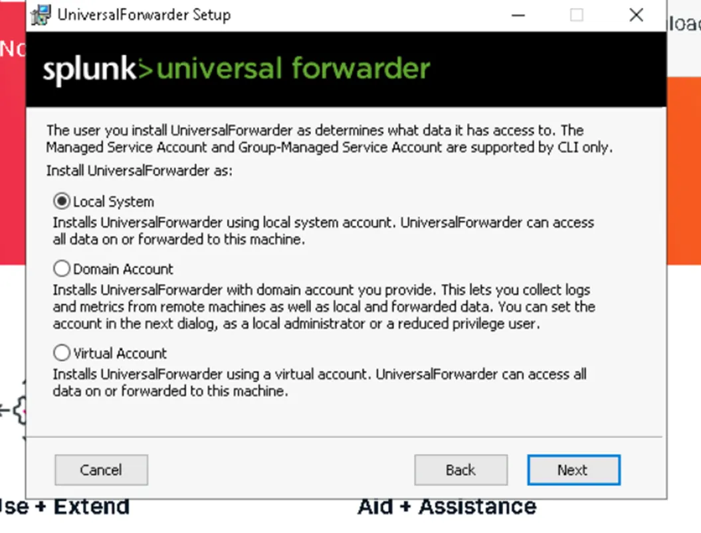
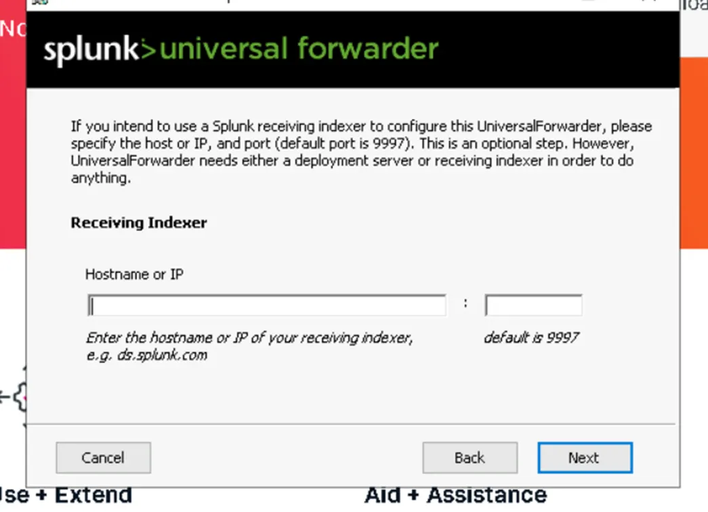
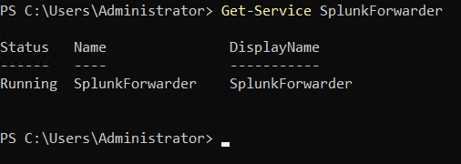
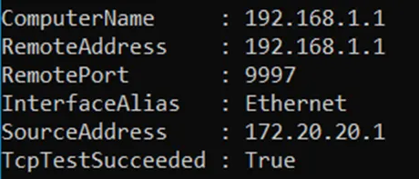

# Universal Forwarder

# Splunk Universal Forwarder

## Objective

Install the Splunk Universal Forwarder (UF) to forward logs to a Splunk indexer (port: 9997).

## Introduction

The Splunk Universal Forwarder (UF) is a lightweight agent developed by Splunk for collecting and forwarding log files, events, and other data from source systems to a central Splunk indexer. It is optimized to consume minimal system resources, making it suitable for deployment on production servers, virtual machines, or distributed environments where performance and security are critical.

The UF does not provide a graphical interface or local analysis capabilities; its primary function is secure data collection and forwarding. It is compatible with a wide range of operating systems, including Linux, Windows, and macOS, and supports multiple hardware architectures (x86_64, ARM, etc.).

### Key Features of the Universal Forwarder

- Real-time collection of log files, directories, syslog streams, and system or application events.
- Secure data transmission to a Splunk indexer over TCP or SSL, with optional encryption and authentication.
- Lightweight and high-performance, minimizing system impact, and suitable for large-scale deployments.
- Modular architecture allowing filtering or transformation of data before forwarding.
- Compatibility with Splunk add-ons.
- Support for major Linux distributions (Rocky Linux, CentOS, Red Hat, Ubuntu), as well as Windows and macOS.
- Can run in “least-privileged” mode under a dedicated user for enhanced security.
- Supports centralized management via Deployment Server.
- Installable via RPM, DEB, or tarball packages, and compatible with automation tools like Ansible, Puppet, or Chef.

## Installation

### Prerequisites

- Splunk login credentials:
    - Username: `admin`
    - Password: `formation`
- A fully updated Rocky Linux server.
- `wget` installed.
- A Splunk account for downloading the Universal Forwarder package.

```bash
sudo dnf update -y
sudo dnf install wget

```

### Installation Steps

### 1. User and Environment Setup

- Log in as `root`.
- Create a Splunk user and group:

```bash
useradd -m splunk
groupadd splunk

```

### 2. Download the Universal Forwarder Package

```bash
wget -O splunkforwarder-10.0.2-e2d18b4767e9.x86_64.rpm "https://download.splunk.com/products/universalforwarder/releases/10.0.2/linux/splunkforwarder-10.0.2-e2d18b4767e9.x86_64.rpm"

```

### 3. Create Installation Directory

```bash
export SPLUNK_HOME="/opt/splunkforwarder"
mkdir $SPLUNK_HOME

```

### 4. Verify the Package

```bash
ls -hl
chmod 644 splunkforwarder-10.0.2-e2d18b4767e9.x86_64.rpm

```

### 5. Install the Package

```bash
rpm -i splunkforwarder-10.0.2-e2d18b4767e9.x86_64.rpm

```

- Assign ownership to the Splunk user:

```bash
chown -R splunk:splunk $SPLUNK_HOME

```

### Activating the Forwarder

1. Accept the license agreement:

```bash
sudo /opt/splunkforwarder/bin/splunk start --accept-license

```

1. Restart the forwarder:

```bash
sudo /opt/splunkforwarder/bin/splunk restart
```

1. Verify forward-server configuration:

```bash
sudo /opt/splunkforwarder/bin/splunk list forward-server

```

---

## Splunk Universal Forwarder for Windows

The Splunk Universal Forwarder (UF) is a lightweight agent installed on a Windows system (PC, server, domain controller, etc.) to collect logs and forward them to a Splunk server for analysis.

### 1. Installation

Go to the Splunk website and download Splunk Universal Forwarder for Windows. Once the download is complete, open the file and the installation wizard will appear.





In our setup, the Splunk server IP address is 192.168.1.1 and the Splunk receiving port is 997.



## 1.2 Check of the Splunk Universal Forwarder agent installation

## Commande

Check whether the SplunkForwarder service is running

```markdown
Get-Service SplunkForwarder
```



Test the TCP network connectivity between your computer and a remote machine (in this case 192.168.1.1) on a specific port (here 9997, the port used by Splunk to receive logs).

```markdown
cd "C:\Program Files\SplunkUniversalForwarder\bin"
./splunk.exe list forward-server
```



## 1.3 Define the index configuration before creating them in Splunk

## Commande

```markdown
notepad "C:\Program Files\SplunkUniversalForwarder\etc\system\local\inputs.conf"

```


Restart the service

```markdown
Restart-Service splunkforwarder
```
